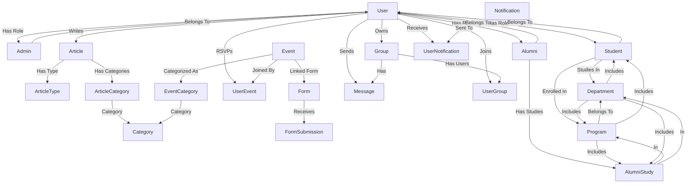

```mermaid
graph TD

%% Users and Roles
User[User]
Admin[Admin]
Student[Student]
Alumni[Alumni]
AlumniStudy[AlumniStudy]

%% Articles
Article[Article]
ArticleType[ArticleType]
ArticleCategory[ArticleCategory]
Category[Category]

%% Events
Event[Event]
EventCategory[EventCategory]
UserEvent[UserEvent]
Form[Form]
FormSubmission[FormSubmission]

%% Groups & Messages
Group[Group]
Message[Message]
UserGroup[UserGroup]

%% Notifications
Notification[Notification]
UserNotification[UserNotification]

%% Programs & Departments
Program[Program]
Department[Department]

%% Relationships

User -->|Has Role| Admin
User -->|Has Role| Student
User -->|Has Role| Alumni
User -->|Writes| Article
User -->|Owns| Group
User -->|Sends| Message
User -->|Joins| UserGroup
User -->|RSVPs| UserEvent
User -->|Receives| UserNotification

Admin -->|Belongs To| User
Student -->|Belongs To| User
Student -->|Studies In| Department
Student -->|Enrolled In| Program

Alumni -->|Belongs To| User
Alumni -->|Has Studies| AlumniStudy
AlumniStudy -->|In| Program
AlumniStudy -->|In| Department

Article -->|Has Type| ArticleType
Article -->|Has Categories| ArticleCategory
ArticleCategory -->|Category| Category

Event -->|Categorized As| EventCategory
Event -->|Linked Form| Form
Event -->|Joined By| UserEvent
EventCategory -->|Category| Category

Form -->|Receives| FormSubmission

Group -->|Has| Message
Group -->|Has Users| UserGroup

Notification -->|Sent To| UserNotification

Program -->|Belongs To| Department
Program -->|Includes| Student
Program -->|Includes| AlumniStudy
Department -->|Includes| Program
Department -->|Includes| Student
Department -->|Includes| AlumniStudy
```