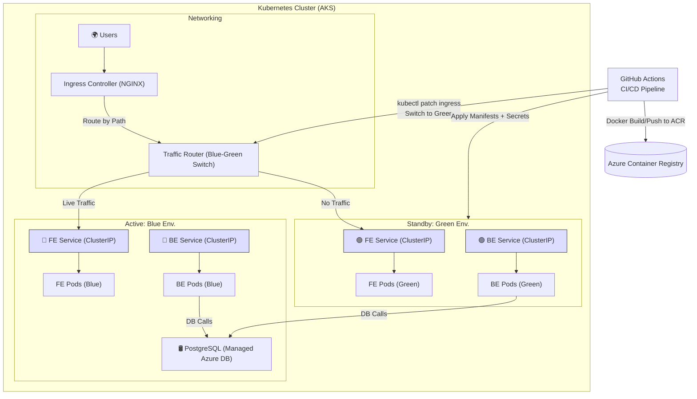

```mermaid
flowchart TD
    subgraph Kubernetes_Cluster["Kubernetes Cluster (AKS)"]
        
        subgraph Networking
            Users["🌍 Users"] --> Ingress["Ingress Controller (NGINX)"]
            Ingress -->|Route by Path| BlueOrGreen["Traffic Router (Blue-Green Switch)"]
        end

        subgraph Blue["Active: Blue Env."]
            direction TB
            B_FE_SVC["🔵 FE Service (ClusterIP)"]:::service --> B_FE_Pods["FE Pods (Blue)"]
            B_BE_SVC["🔵 BE Service (ClusterIP)"]:::service --> B_BE_Pods["BE Pods (Blue)"]
            B_BE_Pods -->|DB Calls| DB["🛢️ PostgreSQL (Managed Azure DB)"]
        end

        subgraph Green["Standby: Green Env."]
            direction TB
            G_FE_SVC["🟢 FE Service (ClusterIP)"]:::service --> G_FE_Pods["FE Pods (Green)"]
            G_BE_SVC["🟢 BE Service (ClusterIP)"]:::service --> G_BE_Pods["BE Pods (Green)"]
            G_BE_Pods -->|DB Calls| DB
        end

        BlueOrGreen -->|Live Traffic| B_FE_SVC
        BlueOrGreen -->|No Traffic| G_FE_SVC
    end

    CI_CD["GitHub Actions\nCI/CD Pipeline"] -->|Docker Build/Push to ACR| AzureCR[(Azure Container Registry)]
    CI_CD -->|Apply Manifests + Secrets| Green
    CI_CD -->|kubectl patch ingress\nSwitch to Green| BlueOrGreen

    classDef service fill:#DDF,stroke:#333,stroke-width:1px, color:#333;
    class B_FE_SVC,B_BE_SVC,G_FE_SVC,G_BE_SVC service;
```