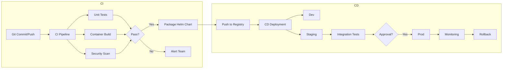

```mermaid
graph LR
    subgraph CI
        A[Git Commit/Push] --> B[CI Pipeline]
        B --> C1[Unit Tests]
        B --> C2[Container Build]
        B --> C3[Security Scan]
        C1 & C2 & C3 --> D{Pass?}
        D -->|Yes| E[Package Helm Chart]
        D -->|No| F[Alert Team]
    end
    subgraph CD
        E --> G[Push to Registry]
        G --> H[CD Deployment]
        H --> I1[Dev]
        H --> I2[Staging]
        I2 --> J[Integration Tests]
        J --> K{Approval?}
        K -->|Yes| L[Prod]
        L --> M[Monitoring]
        M --> N[Rollback]
    end
```